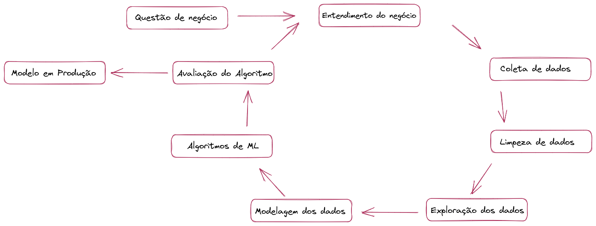
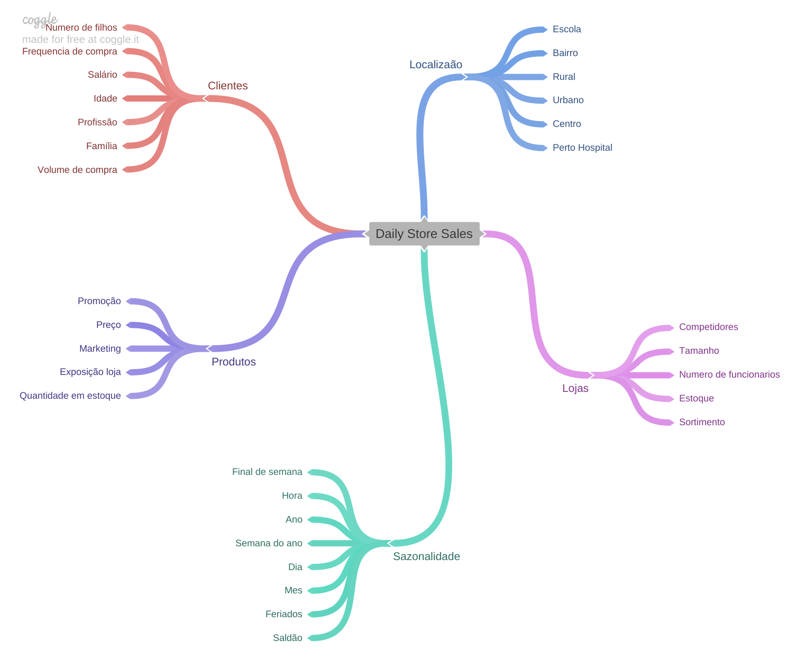
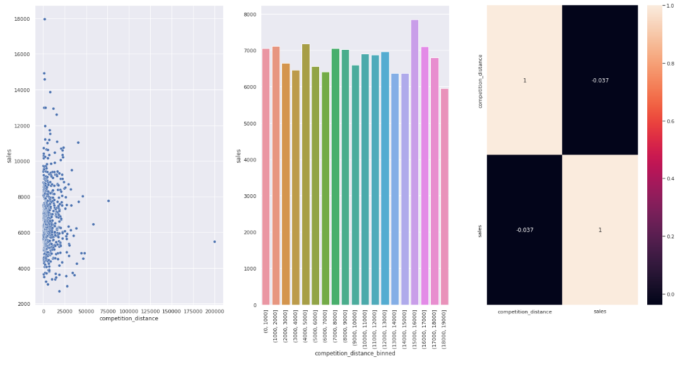
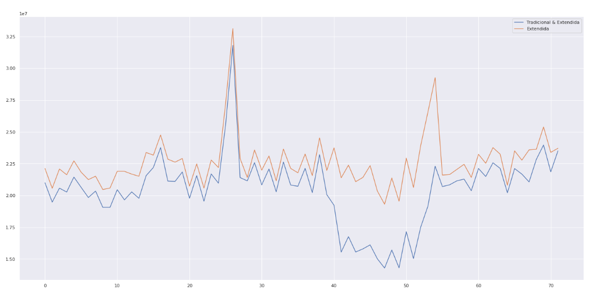
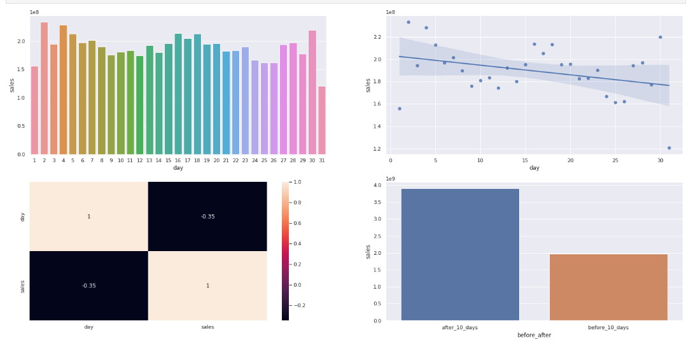
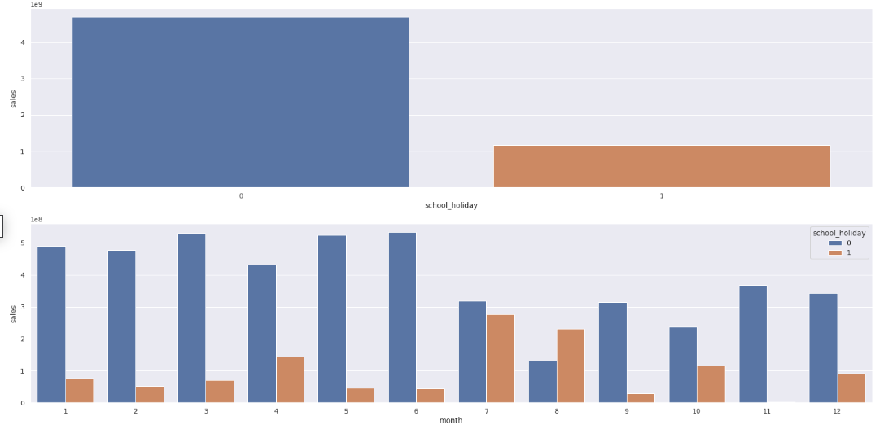

# :department_store: ROSSMANN STORE SALES PREDICTION :department_store:

Estudo de caso realizado no curso DS EM PRODUÇÃO pela [Comunidade DS](https://comunidadeds.com/) com dados da loja Rossmann, disponível em: [Kaggle](https://www.kaggle.com/competitions/rossmann-store-sales)

Tabela de conteúdos
=================
<!--ts-->
* [Problema de Negócio](#problema-de-negócio)
* [Planejamento da Solução](#planejamento-da-solução)
* [Entendimento do Negócio](#entendimento-do-negócio)
* [Coleta dos Dados](#coleta-dos-dados)
* [Limpeza dos Dados](#limpeza-dos-dados)
* [Análise exploratória dos Dados](#análise-exploratória-dos-dados)
* [Modelagem dos Dados](#modelagem-dos-dados)
* [Algorítmo de Machine Learning](#algorítmo-de-machine-learning)
* [Avaliação do Algorítmo](#avaliação-do-algorítmo)
* [Modelo em Produção](#modelo-em-produção)
   
<!--te-->

## PROBLEMA DE NEGÓCIO 

A Rossmann é uma das maiores redes de lojas farmacêuticas da Europa. Estando presente em vários países do continente europeu, como, Alemanha, Espanha, Pol6onia e entre outros.

Em uma reunião com todos os gerentes de cada unidade, o CFO (Chief Financial Officer) levantou alguns questionamentos sobre previsòes diárias de vendas e de faturamento para as próximas 6 semanas.
Com o objetivo final de gerar investimentos para reformas as lojas da rede. Com isso, os gerentes de cada unidade ficaram encarregados de fazer essas previsões em conjunto com o time de cientistas de dados da empresa, entretanto, para que isso fosse feito, vários fatores envolvem essas previsões, como:
- Feriados
- Promoções
- Sazonalidade e etc.

Outro ponto que ele questionou, seria a maneira de como essas informações seriam enviadas à ele.

## PLANEJAMENTO DA SOLUÇÃO:

Após ter visto esta introdução do problema, foi possível entender qual questão de negócio deveria ser resolvida: 
 
 "Prever as próximas 6 semanas de vendas de casa unidade da empresa, de maneira que o CFO acesse essas informações de uma maneira fácil e agrupadas em um único lugar"
  
Por se tratar de uma volumetria grande de dados, será aplicado nesse projeto a metodologia CRISP, onde cada entrega é feita de modo ciclico para a resolver a solução do problema, fazendo com que as entregas sejam mais rápidas e com geração de valor para o time de negócios.

## ENTENDIMENTO DO NEGÓCIO

Com o objetivo definido, foi necessário entender o motivo para que essa previsão fosse elaborada. O intuito dessa previsão é para reformas em todas as unidades Rossmann sejam feitas.

Objetivo do projeto: Este projeto visa fazer as devidas previsões de faturamento todas as lojas. Utilizando os métodos cientificos de análise dos dados coletados. Já que os atuais gerentes das unidades não possuem tal conhecimento técnico. Para isso, foi decidido contratar um cientista de dados, para resolver essa questão.

## COLETA DOS DADOS:

Os dados da loja Rossmann estão disponíveis em: [Rossmann Store Sales](https://www.kaggle.com/competitions/rossmann-store-sales)

## LIMPEZA DOS DADOS:

**Descrição dos Dados:** 

- Dimensionamento das linhas e colunas;
- Verificação dos tipos de dados do conjuto de dados;
- Descobrindo a quantidade de valores nulos e o quanto representa em percentual em relação ao todo dataset;
- Tratamento de todos os valores nulos encontrados, onde foi assumindo uma premissa de negócio de acordo com o contéudo de cada coluna;
- Alteração dos tipos de colunas para facilitar o trabalho com os dados;
- Descrição Estatística das váriveis numéricas e catégoricas;
- Feature Engineering: Nessa fase foi elaborada novas features, a partir de um mapa mental, onde foram levantados algumas hipoteses de acordo com elementos citados neste mapa que de alguma maneira podem afetar as vendas. 

**Descrição das colunas**

colunas | descrição
------- | ---------
store | um ID único para cada loja
day_of_week | o dia da semana
date | data do registro
sales | o volume de negócios para qualquer dia (é isso que você está prevendo)
customers | o número de clientes em um determinado dia
open | um indicador para saber se a loja estava aberta: 0 = fechado, 1 = aberto
promo | indica se uma loja está realizando uma promoção naquele dia
state_holiday | feriado estadual. a = feriado, b = feriado da Páscoa, c = Natal, 0 = nenhum
school_holiday | indica se a (Loja, Data) foi afetada pelo fechamento das escolas públicas
store_type | diferencia entre 4 modelos de lojas diferentes: a, b, c, d
assortment | descreve um nível de sortimento: a = básico, b = extra, c = estendido
competition_distance | distância em metros até a loja concorrente mais próxima
competition_open_since_month | indica o mês aproximados em que o concorrente mais próximo foi aberto
competition_open_since_year | indica o ano aproximados em que o concorrente mais próximo foi aberto
promo2 | promoção contínua e consecutiva para algumas lojas: 0 = não está participando, 1 = participando
promo2_since_week | descreve a semana em que a loja começou a participar do Promo2
promo2_since_year | descreve o ano em que a loja começou a participar do Promo2
promo_interval | descreve os intervalos consecutivos em que o Promo2 é iniciado

**Novas Features**

colunas | descrição
--------|------------
year | ano extraido da coluna data
month | mês extraido da coluna data
day | dia extraido da coluna data
week_of_year | semana do ano extraido da coluna data
competition_since | ano e mês extraido da coluna competition_open_since_year e competition_open_since_month
competition_time_month | quantidade de meses que existe a loja competidora
promo_since | ano e semana que começou a promoção
promo_time_week | quantidade de semanas que a loja está em promoção
is_promo | 0 = não está em promoção, 1 = está em promoção

**Preenchimento dos valores ausentes**

colunas | descrição
--------|------------
competition_distance | utilizando a lógica de que talvez  NA é pq a loja competidora está bem distante, preencher um valor qualquer [200000.0] (maior q o valor maximo do meu dataframe)
competition_open_since_month | preenchido de acordo com a data de registro
competition_open_since_year | preenchido de acordo com a data de registro
promo2_since_week | preenchido de acordo com a data de registro
promo2_since_year | preenchido de acordo com a data de registro
promo_interval | preenchido com o valor zero

## ANÁLISE EXPLORATÓRIA DOS DADOS:

O objetivo deste tópico é entender e adquirir mais conhecimento sobre o modelo de negócio da Rossmann, além de validar algumas hipóteses que foram trazidas pela equipe de negócio da mesma.
Para isso, foram feitos alguns passos, como:
- Filtragem dos dados: Remoção das lojas que estavam fechadas e ou remoção das lojas que não obtiveram vendas naquele respectivo dia.
- Seleções das colunas: Features mais relevantes para o modelo de négocio;
- Analise univáriada: Visualização de gŕaficos para saber como uma varáivel afeta o fenômeno das vendas;
- Análise bivariada : Exploração detalhada de duas ou mais váriaveis afim de gerar validaçês das hipotéses listadas, adquirir mais conhecimento sobre o modelo de negócio do projeto e gerar novas insights.
- Análise multivariada: Correlação entre ás váriaveís tanto numérica quanto categoricas.

Com esses tópicos realizados, foi possível verificar quais hipóteses eram de fato válidas:

**Hipótese 2**: Lojas com competidores mais próximos deveriam vender menos.
- **Falsa**, porque na verdade os competidores que estão vendendo mais são os mais próximos.

**Hipótese 7**: Lojas com mais promoções consecutivas deveriam vender mais.
- **Falsa**, Lojas com mais promoções consecutivas vendem menos.

**Hipótese 11**: Lojas deveriam vender mais depois do dia 10 de cada mês.
- **Verdadeira**, porque vendem mais depois do dia 10 de cada mês.

**Hipótese 13**: Lojas deveriam vender menos durante os feriados escolares.
- **Verdadeira**, vendem realmente menos durante os feriados escolares.

## MODELAGEM DOS DADOS:

Depois dos dados terem sidos preparados para a implementação do modelo de machine learning, eles precisaram ser transformados em dados numéricos e de mesma grandeza.
Feito isso, foram realizados as seguintes etapas:
- Rescaling: Para as features numéricas, foram usados os métodos RobustScaler para as váriaveis com outiliers mais acentuados, onde objetivo deste metodo é coletar os quartil dos dados. E para outras váriaveis com menos outiliers foi optado a utilização do MinMaxScaler para esse dimensionamento;
- Encoding: Para features categoricas foram usados os métodos one hot enconding, label enconding e ordinal enconding;
- Tranformação de Grandeza: Foi feita uma transformação da feature "sales", que é nossa váriavel resposta, para que possa está na mesma escal numérica que os demais features.
- Transformação de Natureza: Nas features que há um período de tempo ciclíco, foi feita uma normalização, calculando a distância de um período ao outro, usando seno e conseno.
- Seleção das Features: Por último, foi utlizando o algorimo Borutapy que tem o objetivo de remover as colunas que são colineares, ous seja, que não acrescentam melhorias na performance da previsão de vendas deste projeto.

## ALGORÍTMO DE MACHINE LEARNING

Os modelos de ML foram utilizados afim de saber a complexidade dos dados do projeto. Inicialmente foi escolhido um modelo de média como "baseline" e outros quatros modeleos para testar se os dados são lineares ou não lineares. Para esse teste inicial house a divisão de uma parte dos dados para o aprendizado do modelo.

Nesta etapa foram utilizadas os seguintes algorítmos de ML para a realização da Regressão:
- Random Forest Regression
- Linear Regression
- Lasso
- XGBoots

Foi feito um método de Cross-Validation, onde ele demonstrava em tempos diferentes parte dos dados para que fosse possível analisar e medir uma performace real do modelo.

 - MAE → A soma da diferença entre o valor real e o valor da predição, dividido pelo numero de valor predito (média do error).
 - MAPE → É a porcentagem de error do MAE. Mostra o quão longe a predição está do valor real, na média, em porcentagem.
 - RMSE (Root Mean Square Error) → Muito usado para calcular a performance do algoritmo Machine Learning, pois atribui peso, ou seja, atribui maior peso a erros maiores. Sendo rígido aos outliers.

Modelo | MAE | MAPE | RMSE
--------|------------ | --------- | ------
Linear Regression |	2081.31 +/- 295.69	| 0.3 +/- 0.02	| 2951.88 +/- 468.22
Lasso	| 2115.78 +/- 341.38 |	0.29 +/- 0.01	| 3056.85 +/- 503.74
Random Forest Regressor	| 861.57 +/- 251.59 |	0.12 +/- 0.03	| 1300.16 +/- 388.43
XGBoost Regressor	| 1080.4 +/- 189.09 |	0.15 +/- 0.02	| 1560.7 +/- 273.31

O algoritmo Random Forest Regression apesar de ter uma porcentagem de erro MAPE menor dos outros nesse projeto, o algoritmo XGBoost foi escolhido para fazer a previsão de vendas dos dados, por conta de estar dentro de um escopo de projeto com metodologia CRISP e da sua rapidez para treinar e ajustar os dados quando comparado com a Random Forest.

## AVALIAÇÃO DO ALGORÍTMO

Depoos de fazer a avaliação do algorítmo, é realizada a etapa em que se calcula o quanto a empresa terá de retorno financeiro após as aplicações das recomendações que o modelo de dados disponibilizou.
Com essa interpretação, é possível ver qual loja porojeta um melhor e pior cenário para as próximas 6 semanas em relação a faturamento.

Loja | Previção |	Pior cenário | Melhor cenário	| MAE |	MAPE
--------|------------ | --------- | ------| --------- | ------
292 |	105759.242188 |	102494.061305 |	109024.423070 |	3265.180883 |	0.559597
909 |	244256.781250 |	236776.993674 |	251736.568826 |	7479.787576 |	0.511927
876 |	210280.296875 |	206328.857072 |	214231.736678 |	3951.439803 |	0.319502
595 |	372453.875000 |	368217.142050 |	376690.607950 |	4236.732950 |	0.298223
722 |	352444.875000 |	350467.878180 |	354421.871820 |	1976.996820 |	0.266096

Com esses resultados, foi possível verificar o retorno financeiro que as lojas terão :moneybag:	 :

Cenário |	Faturamento
--------|------------
Previção	| R$287,070,341.82
Pior cenário |	R$286,353,756.82
Melhor cenário |	R$287,786,926.82

## MODELO EM PRODUÇÃO

Depois de realizada toda a questão de estudo de previsão financeira, houve o deploy do projeto em um bot do telegram, onde o CFO poderá consultar a previsão de faturamento de qualquer loja, pelo mesmo.

